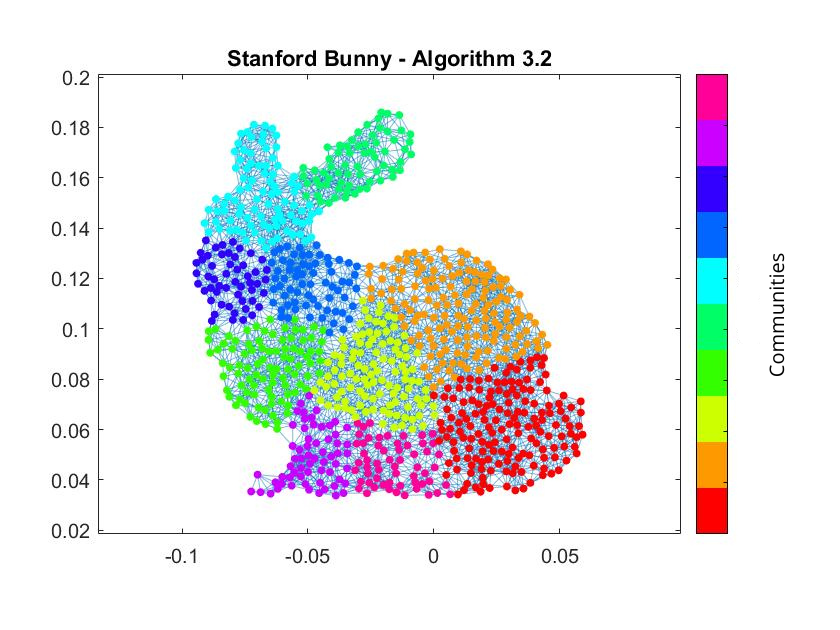

# CommDet

A MATLAB package for community detection in graphs.

 

 
Fig. 1 Stanford Bunny - graph partitioning into disjoint communities

Description of the Code
-----------------------

The package contains some *MATLAB* functions for graph partitioning into two or more than two disjoint communities. The algorithms has been implemented based on the spectral methods introduced by Newman (for more details, see [1] and [2]) based on the maximization of the modularity.

- The function **algorithm_1.m** is used to divide the graph into two disjoint communities, based on the leading eigenvector $u_1$ of the modularity matrix

-	The function **algorithm_2.m** is used to divide the graph into two disjoint communities, based on the eigenvector $u_2$ corresponding to the second largest eigenvalue of the normalized Laplacian

- The function **algorithm_3.m** is used to divide the graph into more than two communities by iteratively applying one of the previous algorithms until no further subdivision increases the graph's modularity

- The function **calculate_modularity.m** is used to compute the modularity of a given graph partition

-	The function **algorithm_1_magnitudes.m** is used to visualize the magnitudes of the leading eigenvector $u_1$ of the modularity matrix, computing the saturation based on the values of $u_1$

A simple example for the usage of the functions is provided in the script **example.m**. It shows how to apply the community detection method provided by Algorithm 3 and how to visualize the magnitudes of the elements of $u_1$, demonstrating that, with reference to Algorithm 1, the magnitudes indicate the 'strength' with which the corresponding nodes belong to their respective communities

 

Citation and Credits
--------------------

The theory on the spectral methods for community detection in graphs implemented can be found in 

*   [1] &nbsp; Newman, M. E.  
    <i> Finding community structure in networks using the eigenvectors of matrices  </i>  
    Phys. Rev. E. 74(3), 036104 (2006)

*   [2] &nbsp; Newman, M. E.  
    <i> Spectral methods for community detection and graph partitioning  </i>  
    Phys. Rev. E. 88(4), 042822 (2013)
 
 
