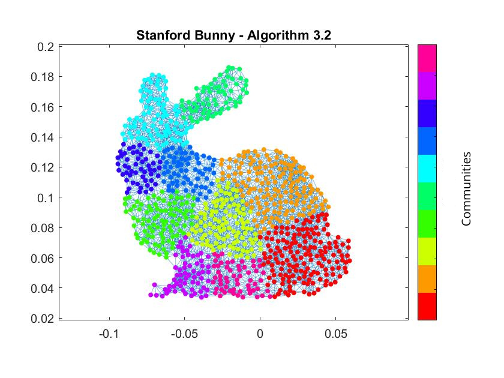
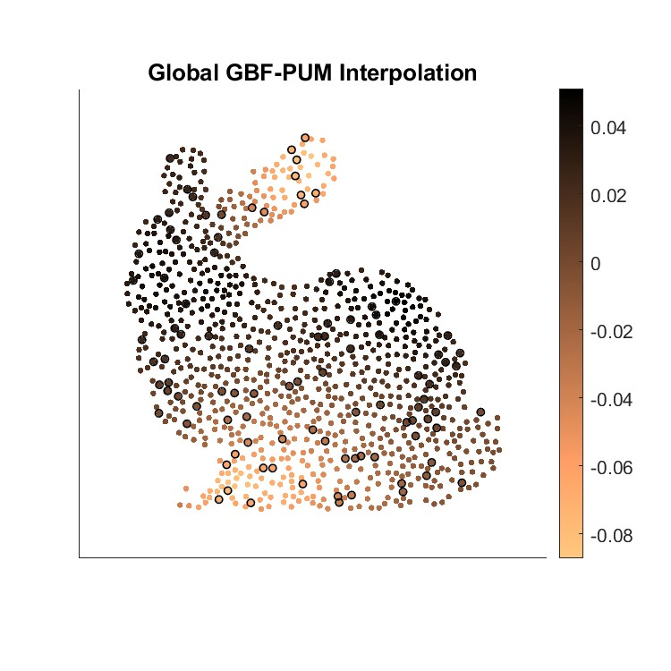
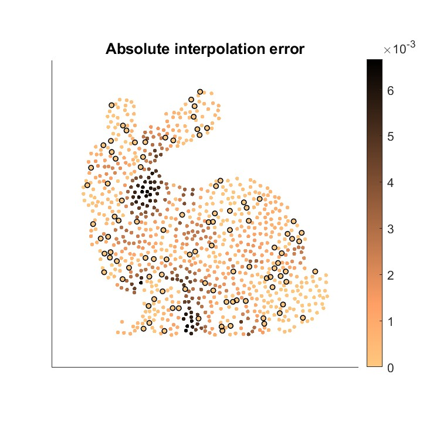

# CommDet

**A MATLAB package for community detection applied to GBF-PUM signal approximation on graphs.**

 
 

Fig. 1 Result obtained from the example_communities.m script. It shows the disjoint communities obtained through Algorithm 3.2 applied to the Stanford Bunny.

Description of the Code
-----------------------

The main contains the following parts:

- The subfolder *./core* contains the core code of the package for graph signal approximation: the proposed approach combines a spectral community detection method with the Partition of Unity method (PUM)

- The subfolder *./data* contains several *.mat* files, some imported from [6] and some obtained by converting the datasets available in [7] from the *.gml* format to the *.mat* format

- The subfolder *./images* contains some significant plots generated by the scripts

- The script **example_communities.m** is a simple example of applying the community detection method from Algorithm 3.2 and visualizing the magnitudes of the elements of $u_1$. It also demonstrates that, in reference to Algorithm 1, these magnitudes reflect the 'strength' with which the corresponding nodes belong to their respective communities

- The script **example_GBFPUM.m** provides an example of usage of the whole package by testing the GBF-PUM signal approximation scheme in combination with the chosen community detection method

    
    

Fig. 2 Result obtained from the example_GBFPUM.m script. Left: Global GBF-PUM interpolant of the test function for the given samples. Right: Absolute error with respect to the original signal. 

  

Let's focus on the routines contained in the *./core* subfolder, which included several MATLAB functions, some for graph partitioning into two or more disjoint communities, and others for applying a GBF-PUM signal approximation scheme on graphs. The community detection algorithms are an implementation of the spectral methods introduced by M. Newman (for more details, see [1] and [2]) based on the maximization of the modularity. The routines for the kernel-based interpolation scheme based on a Partition of Unity Method, instead, are imported (and, in some cases, updated) from [5] and [6].

- The function **algorithm_1.m** is used to divide the graph into two disjoint communities, based on the leading eigenvector $u_1$ of the modularity matrix, while **algorithm_1_magnitudes.m** is used to visualize the magnitudes of $u_1$

- The function **algorithm_2.m** is used to divide the graph into two disjoint communities, based on the eigenvector $u_2$ corresponding to the second largest eigenvalue of the normalized Laplacian

- The function **algorithm_3.m** is used to divide the graph into more than two communities by iteratively applying one of the previous algorithms until no further subdivision increases the graph's modularity

- The function **calculate_modularity.m** is used to compute the modularity of a given graph partition

- The functions **GBF_gengraph.m** and **GBF_sim_rballs.m** are imported from [6] and used to generate the graph from different datasets

- The functions **GBF_domainaugment.m**, **GBF_genPUM.m** are imported (and, in the first case, updated) from [5] and used to generate a partition of unity on the graph, starting from the disjoint communities obtained through Algorithm 3

- The functions **GBF_genGBF.m**, **GBF_genGBF2.m**, **GBF_RLSGBF.m** provide a solution of the local interpolation problems and **GBF_RLSGBFPUM.m** calculates the global GBF-PUM signal approximation (all the routines are imported from [5], [6])

- The functions **GBF_spectrum.m** and **GBF_drawsignal.m** are imported from [6] and used to, respectively, calculate the eigendecomposition of the graph Laplacian and draw the signal on the nodes of the graph

 

Citation and Credits
--------------------

The theory on the implemented spectral methods for community detection in graphs can be found in:

*   [1] &nbsp; Newman, M. E.  
    <i> Finding community structure in networks using the eigenvectors of matrices  </i>  
    Phys. Rev. E. 74(3), 036104 (2006)

*   [2] &nbsp; Newman, M. E.  
    <i> Spectral methods for community detection and graph partitioning  </i>  
    Phys. Rev. E. 88(4), 042822 (2013)

The theory on graph basis functions (GBFs) for kernel-based signal interpolation on graphs is given in:

*   [3] &nbsp; Cavoretto, R., De Rossi, A., Erb, W.  
    <i> Partition of Unity Methods for Signal Processing on Graphs </i>  
    J. Fourier Anal. Appl. 27 (2021), Art. 66  

*   [4] &nbsp; Erb, W.  
    <i> Graph Signal Interpolation with Positive Definite Graph Basis Functions  </i>  
    Appl. Comput. Harmon. Anal. 60 (2022), 368-395
    
Some of the routines are imported from the following packages:

*   [5] &nbsp;  Erb, W.  
    GitHub: https://github.com/WolfgangErb/GBFPUM

*   [6] &nbsp;  Erb, W.  
    GitHub: https://github.com/WolfgangErb/GBFlearn

Some datasets are imported from [6], while others are imported from:
*  [7] &nbsp;  Newman, M.  
   Network data: https://websites.umich.edu/~mejn/netdata/

and then converted from the *.gml* format to the *.mat* format by computing the adjacency matrix based on the edge information between nodes.

 
